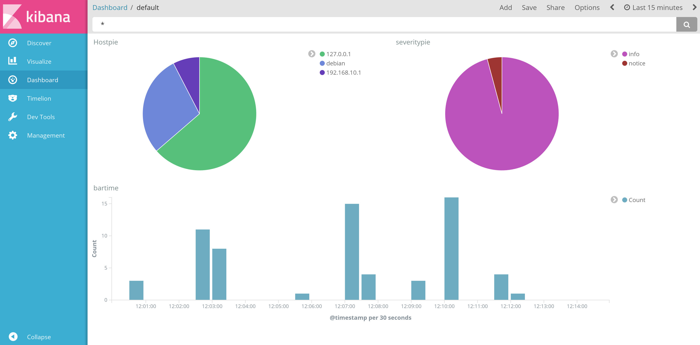

# ITDEV Week 16 #

# Monitoring #

 * Keep track of s system.
 * Know what is going on.
 * Everything is running.

## Software ##

 * Nagios (status right now).
 * Zabbix (time series).
 * Observium.
 * Cacti

**Humans are good at looking at graphs**

If stuff is looking bad in the monitoring software then go on to the log-files.

# Assignment #

Get an SRX router to send logs to a Debian system.

Tasks:

 * Setup a SRX VM
 * Setup a Debian VM
 * Configure the network on the VM's
 * Configure the SRX to send the log-files. (root password: a123456)
 * Configure Debian to receive the logs. (root password: test)

# Syslog protocol #

 * Either UDP or TCP.
 * Syslog can use TLS.

# Assignment II (Install an ELKS stack)#

**This is an example install only therefore no hardening has been done.** *Kibana listens on all addresses.*

I have created (no variables, very simple, but its gonna be yuge!) an ansible playbook to install an ELKS stack on the Debian VM.
I have turned the Elasticsearch and Logstash memory usage down, to save some memory in the VM.

# Resources #

 * [https://www.oreilly.com/learning/a-guide-to-elasticsearch-5-and-the-elkelastic-stack](https://www.oreilly.com/learning/a-guide-to-elasticsearch-5-and-the-elkelastic-stack)
 * [https://www.digitalocean.com/community/tutorials/how-to-centralize-loags-with-rsyslog-logstash-and-elasticsearch-on-ubuntu-14-04](https://www.digitalocean.com/community/tutorials/how-to-centralize-loags-with-rsyslog-logstash-and-elasticsearch-on-ubuntu-14-04)
 * [https://kartar.net/2014/09/when-logstash-and-syslog-go-wrong/](https://kartar.net/2014/09/when-logstash-and-syslog-go-wrong/)
 * [http://www.rsyslog.com/doc/v8-stable/configuration/templates.html](http://www.rsyslog.com/doc/v8-stable/configuration/templates.html)
 * [https://kartar.net/2014/09/when-logstash-and-syslog-go-wrong/](https://kartar.net/2014/09/when-logstash-and-syslog-go-wrong/)
